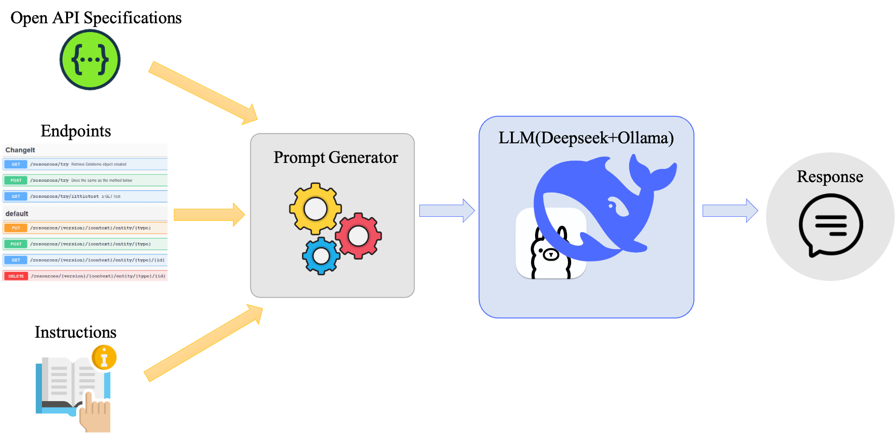
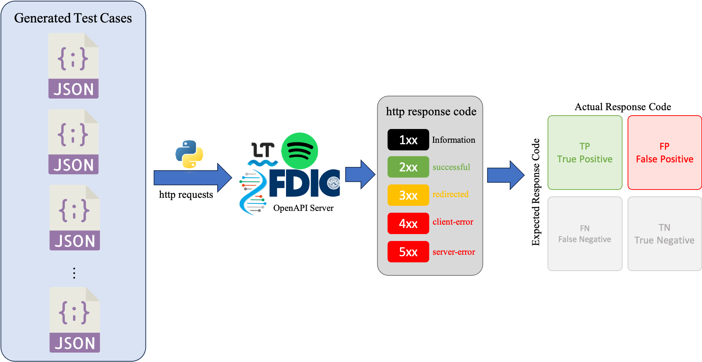

# Requirements
```bash
pip install -r requirements.txt
```
    or
```bash
pip3 install -r requirements.txt
```

## Install local Deepseek-r1 Model
<!-- Please check this [online tutorial](https://www.datacamp.com/tutorial/deepseek-r1-ollama), or simply refer to our report installation section. The model we install is `deepseek-r1:14b` -->
### Install process
1. Install Ollama: visit [Ollama website](https://ollama.com/) and download the corresponding OS version.


2. Check if installed correctly: open terminal and type `ollama -v`, you should see the following result.


3. Choose desired LLM from Deepseek: visit [DeepSeek-R1](https://ollama.com/library/deepseek-r1) on Ollama website and choose the desired parameters. Taking deepseek-r1:14b for example, after choosing it will automatically generate the command: `ollama run deepseek-r1:14b`. Run it on your terminal and wait for the installation. It will automatically run the installation process if it’s the first time you run this model. 


4.	Check installed model: use command `ollama list` to check if deepseek-r1:14 is correctly installed locally.


5.	Run your local LLM: use command `ollama run deepseek-r1:14b` on terminal


### How to interact with our local DeepSeek-R1? Terminal and Ollama API:
* Terminal: Once you completely install Deepseek, you can start to ask questions via terminal.


* [Ollama API](https://github.com/ollama/ollama/blob/main/docs/api.md): Since we are going to automatically send out all the generated prompts to LLM, we will utilize Ollama API to achieve that.


# Files Descriptions
* `prompt_generator.ipynb`: How we generate the prompts based on OpenAPI Specifications, Endpoints and Instructions. The prompts are generated and exported to folder `/prompt`
* `ollama_api.ipynb`: Send the generated prompts to locally installed LLM
* `test_case_parser.ipynb`: Parse and extract the JSON block from LLM response
* `send_request.ipynb`: Send requests from test cases and evaluate the result

# Implementation(based on the following roadmap)

1. Generate the corresponding prompts: please check `prompt_generator.ipynb` and run full code.
2. Make sure you have correctly installed the local Deepseek, and then refer `ollama_api.ipynb` and run full code to send prompts and receive responses.

3. Parse the expported responses from LLM and extract the JSON block within it. Please check `test_case_parser` and run full code to generate test cases.

4. Send request to OpenAPI with test cases and check the result, please check `send_request.ipynb` and run full code.

