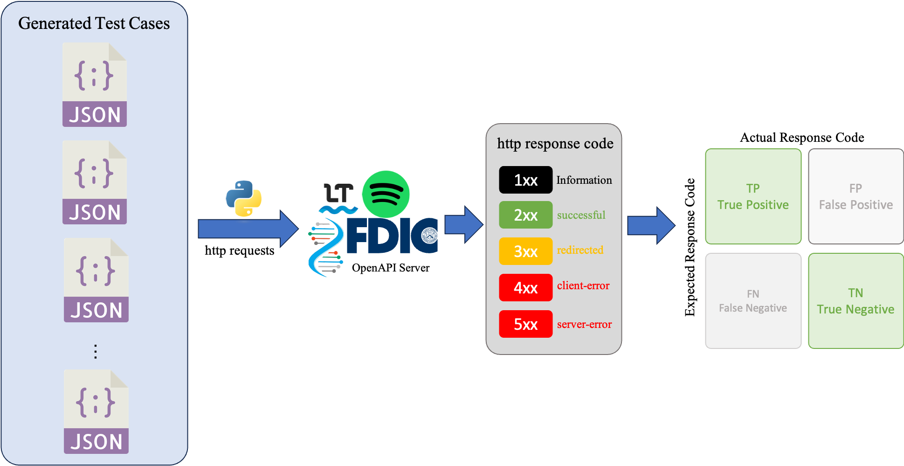

# Requirements
```bash
pip install -r requirements.txt
```
    or
```bash
pip3 install -r requirements.txt
```

## Install local Deepseek-r1 Model
Please check this [online tutorial](https://www.datacamp.com/tutorial/deepseek-r1-ollama), or simply refer to our report installation section. The model we install is `deepseek-r1:14b`

# Files Descriptions
* `prompt_generator.ipynb`: How we generate the prompts based on OpenAPI Specifications, Endpoints and Instructions. The prompts are generated and exported to folder `/prompt`
* `ollama_api.ipynb`: Send the generated prompts to locally installed LLM
* `test_case_parser.ipynb`: Parse and extract the JSON block from LLM response
* `send_request.ipynb`: Send requests from test cases and evaluate the result

# Implementation(based on the following roadmap)

1. Generate the corresponding prompts: please check `prompt_generator.ipynb` and run full code.
2. Make sure you have correctly installed the local Deepseek, and then refer `ollama_api.ipynb` and run full code to send prompts and receive responses.

(waiting the fuzzing figure)

3. Parse the expported responses from LLM and extract the JSON block within it. Please check `test_case_parser` and run full code to generate test cases.

4. Send request to OpenAPI with test cases and check the result, please check `send_request.ipynb` and run full code.

